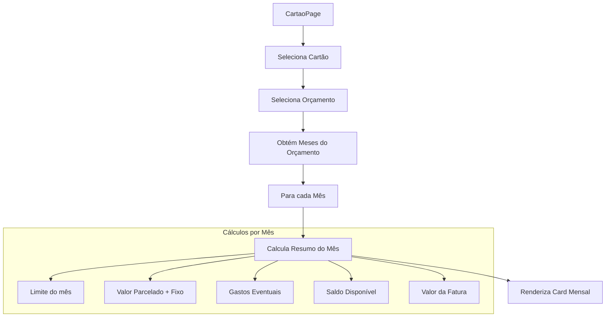

# Plano Técnico: Resumo Mensal de Faturas na Tela de Cartões

## 1. Visão Geral da Funcionalidade

Incluir na tela de Cartões (`CartaoPage`) uma seção com cards de resumo para **todos os meses cadastrados no orçamento selecionado**. Estes cards aparecerão na parte inferior da tela, após os resumos da fatura atual.

**Importante**: Os cards devem exibir **todas as informações preenchidas** para cada mês, sem necessidade de interação do usuário para revelar o conteúdo. Todos os dados são calculados e exibidos automaticamente.

## 2. Análise do Código Atual

### 2.1 Componente CartaoPage
- **Arquivo**: [`frontend/src/App.jsx`](frontend/src/App.jsx) (linhas 1529-2247)
- **Props recebidas**:
  - `cartoes`, `setCartoes` - Lista e setter de cartões
  - `lancamentosCartao`, `setLancamentosCartao` - Lançamentos de cartão
  - `orcamentos` - Orçamentos disponíveis (contém meses)
  - `setDespesas`, `categorias`, `gastosPredefinidos`

### 2.2 Cálculos Existentes (já implementados)
```javascript
// Linhas 1559-1571
const { fixoParcelado, gastosMes, totalMes } = useMemo(() => {
  let fixo = 0;
  let gastos = 0;
  filteredLancamentos.forEach(l => {
    const val = parseFloat(l.valor) || 0;
    if (l.tipoRecorrencia === "FIXO" || l.tipoRecorrencia === "PARCELADO") {
      fixo += val;
    } else {
      gastos += val;
    }
  });
  return { fixoParcelado: fixo, gastosMes: gastos, totalMes: fixo + gastos };
}, [filteredLancamentos]);

// Linhas 1573-1580
const valorAlocado = useMemo(() => {
  if (!selectedCartao) return 0;
  const limitesMensais = selectedCartao.limitesMensais || {};
  if (limitesMensais[selectedMes] !== undefined && limitesMensais[selectedMes] !== null) {
    return parseFloat(limitesMensais[selectedMes]);
  }
  return parseFloat(selectedCartao.limite) || 0;
}, [selectedCartao, selectedMes]);

// Linha 1582
const saldoMes = valorAlocado - totalMes;
```

### 2.3 Estrutura CSS Atual
- **Grid de resumo**: `.dashboard-grid` com `grid-template-columns: repeat(auto-fit, minmax(200px, 1fr))`
- **Cards**: `.summary-card` com padding, border-radius e bordas
- **Responsividade**: Media queries em `@media (max-width: 900px)` e `@media (max-width: 480px)`

## 3. Arquitetura da Solução

### 3.1 Diagrama de Fluxo



### 3.2 Estrutura de Componentes

```
CartaoPage
├── panel.filters-panel (já existe)
│   ├── Select Cartão
│   └── Select Mês
├── panel (já existe - Lançamentos)
│   ├── Tabela de Lançamentos
│   └── dashboard-grid (Resumo Fatura Atual)
│       ├── Limite do Cartão
│       ├── Fatura Atual
│       ├── Disponível
│       └── Status
└── panel (NOVO - Resumo Mensal)
    └── monthly-summary-grid (NOVO)
        └── MonthlySummaryCard (NOVO - um para cada mês)
            ├── Título: Fatura de [Mês]
            ├── Limite do mês
            ├── Parcelado + Fixo
            ├── Gastos efetuados
            ├── Saldo no mês
            └── Valor da fatura
```

## 4. Especificação Técnica Detalhada

### 4.1 Nova Função: `calculateMonthSummary`

Criar função utilitária para calcular resumo de um mês específico:

```javascript
// Função a ser adicionada dentro de CartaoPage
const calculateMonthSummary = useCallback((cartaoId, mes) => {
  const cartao = cartoes.find(c => c.id === cartaoId);
  if (!cartao) return null;

  // Filtrar lançamentos do mês
  const lancamentosDoMes = lancamentosCartao.filter(l => 
    l.cartaoId === cartaoId && 
    (l.mesReferencia === mes || (l.meses && l.meses.includes(mes)))
  );

  // Calcular valores
  let fixoParcelado = 0;
  let gastosEventuais = 0;

  lancamentosDoMes.forEach(l => {
    const val = parseFloat(l.valor) || 0;
    if (l.tipoRecorrencia === "FIXO" || l.tipoRecorrencia === "PARCELADO") {
      fixoParcelado += val;
    } else {
      gastosEventuais += val;
    }
  });

  // Limite do mês
  const limitesMensais = cartao.limitesMensais || {};
  const limite = limitesMensais[mes] !== undefined && limitesMensais[mes] !== null
    ? parseFloat(limitesMensais[mes])
    : parseFloat(cartao.limite) || 0;

  const totalFatura = fixoParcelado + gastosEventuais;
  const saldo = limite - totalFatura;
  const isFechada = cartao.faturasFechadas?.includes(mes) || false;

  return {
    mes,
    limite,
    fixoParcelado,
    gastosEventuais,
    totalFatura,
    saldo,
    isFechada
  };
}, [cartoes, lancamentosCartao]);
```

### 4.2 Novo useMemo: `allMonthsSummary`

Calcular resumo de todos os meses do orçamento:

```javascript
const allMonthsSummary = useMemo(() => {
  if (!effectiveCartaoId || !effectiveOrcamentoId) return [];
  
  const orcamento = orcamentos.find(o => o.id === effectiveOrcamentoId);
  if (!orcamento || !orcamento.meses) return [];

  return orcamento.meses
    .map(mes => calculateMonthSummary(effectiveCartaoId, mes))
    .filter(summary => summary !== null);
}, [effectiveCartaoId, effectiveOrcamentoId, orcamentos, calculateMonthSummary]);
```

### 4.3 Identificação do Orçamento Atual

Adicionar lógica para identificar o orçamento baseado no mês selecionado:

```javascript
// Encontrar orçamento que contém o mês selecionado
const effectiveOrcamento = useMemo(() => {
  return orcamentos.find(o => o.meses && o.meses.includes(selectedMes));
}, [orcamentos, selectedMes]);

const effectiveOrcamentoId = effectiveOrcamento?.id || orcamentos[0]?.id || "";
```

### 4.4 Novo Componente: `MonthlySummaryCard`

**Nota**: Os cards exibem todas as informações diretamente, sem necessidade de interação. O destaque visual do mês selecionado é apenas informativo.

```jsx
const MonthlySummaryCard = ({ summary, isCurrentMonth }) => {
  const {
    mes,
    limite,
    fixoParcelado,
    gastosEventuais,
    totalFatura,
    saldo,
    isFechada
  } = summary;

  return (
    <div className={`monthly-summary-card ${isCurrentMonth ? 'current-month' : ''}`}>
      <div className="monthly-summary-card__header">
        <h4 className="monthly-summary-card__title">Fatura de {mes}</h4>
        <div className="monthly-summary-card__badges">
          {isCurrentMonth && (
            <span className="monthly-summary-card__badge current">Atual</span>
          )}
          {isFechada && (
            <span className="monthly-summary-card__badge closed">Fechada</span>
          )}
        </div>
      </div>
      
      <div className="monthly-summary-card__content">
        <div className="monthly-summary-card__row">
          <span className="label">Limite:</span>
          <span className="value">{formatCurrency(limite)}</span>
        </div>
        
        <div className="monthly-summary-card__row">
          <span className="label">Parcelado + Fixo:</span>
          <span className="value">{formatCurrency(fixoParcelado)}</span>
        </div>
        
        <div className="monthly-summary-card__row">
          <span className="label">Gastos:</span>
          <span className="value">{formatCurrency(gastosEventuais)}</span>
        </div>
        
        <div className="monthly-summary-card__row">
          <span className="label">Saldo:</span>
          <span className={`value ${saldo >= 0 ? 'positive' : 'negative'}`}>
            {formatCurrency(saldo)}
          </span>
        </div>
        
        <div className="monthly-summary-card__row total">
          <span className="label">Valor Fatura:</span>
          <span className="value">{formatCurrency(totalFatura)}</span>
        </div>
      </div>
    </div>
  );
};
```

## 5. Estilos CSS

### 5.1 Novas Classes CSS

```css
/* Container para os cards mensais */
.monthly-summary-grid {
  display: grid;
  grid-template-columns: repeat(auto-fill, minmax(220px, 1fr));
  gap: 12px;
  margin-top: 12px;
}

/* Card individual de resumo mensal */
.monthly-summary-card {
  background: #f8fafc;
  border: 1px solid #e2e8f0;
  border-radius: 8px;
  padding: 12px;
  transition: all 0.2s ease;
}

.monthly-summary-card.current-month {
  border-color: #2563eb;
  background: #eff6ff;
}

/* Cabeçalho do card */
.monthly-summary-card__header {
  display: flex;
  justify-content: space-between;
  align-items: center;
  margin-bottom: 10px;
  padding-bottom: 8px;
  border-bottom: 1px solid #e2e8f0;
}

.monthly-summary-card__title {
  margin: 0;
  font-size: 0.95em;
  font-weight: 600;
  color: #0f172a;
}

.monthly-summary-card__badges {
  display: flex;
  gap: 4px;
}

.monthly-summary-card__badge {
  padding: 2px 8px;
  border-radius: 12px;
  font-size: 0.7em;
  font-weight: 600;
}

.monthly-summary-card__badge.current {
  background: #dbeafe;
  color: #1e40af;
}

.monthly-summary-card__badge.closed {
  background: #fee2e2;
  color: #991b1b;
}

/* Conteúdo do card */
.monthly-summary-card__content {
  display: flex;
  flex-direction: column;
  gap: 4px;
}

.monthly-summary-card__row {
  display: flex;
  justify-content: space-between;
  align-items: center;
  font-size: 0.85em;
}

.monthly-summary-card__row .label {
  color: #64748b;
}

.monthly-summary-card__row .value {
  font-weight: 600;
  color: #0f172a;
}

.monthly-summary-card__row .value.positive {
  color: #16a34a;
}

.monthly-summary-card__row .value.negative {
  color: #dc2626;
}

.monthly-summary-card__row.total {
  margin-top: 6px;
  padding-top: 6px;
  border-top: 1px dashed #e2e8f0;
}

.monthly-summary-card__row.total .value {
  font-size: 1.1em;
  color: #dc2626;
}

/* Responsividade */
@media (max-width: 900px) {
  .monthly-summary-grid {
    grid-template-columns: repeat(auto-fill, minmax(180px, 1fr));
    gap: 8px;
  }
  
  .monthly-summary-card {
    padding: 10px;
  }
  
  .monthly-summary-card__title {
    font-size: 0.9em;
  }
  
  .monthly-summary-card__row {
    font-size: 0.8em;
  }
}

@media (max-width: 480px) {
  .monthly-summary-grid {
    grid-template-columns: 1fr;
  }
  
  .monthly-summary-card {
    padding: 10px;
  }
}
```

## 6. Estrutura JSX Final

```jsx
// Adicionar após o fechamento do </section> dos lançamentos (após linha 2082)

{/* Seção de Resumo Mensal - NOVA */}
<section className="panel monthly-summary-section">
  <h3 style={{ borderBottom: '1px solid #eee', paddingBottom: '10px', marginBottom: '15px' }}>
    Resumo Mensal das Faturas - <span className="badge-year">{effectiveOrcamento?.label || 'Orçamento'}</span>
  </h3>
  
  {allMonthsSummary.length === 0 ? (
    <p className="empty-message">Nenhum mês disponível no orçamento selecionado.</p>
  ) : (
    <div className="monthly-summary-grid">
      {allMonthsSummary.map((summary) => (
        <MonthlySummaryCard
          key={summary.mes}
          summary={summary}
          isCurrentMonth={summary.mes === selectedMes}
        />
      ))}
    </div>
  )}
</section>
```

## 7. Requisitos de Responsividade

### 7.1 Breakpoints

| Breakpoint | Comportamento |
|------------|---------------|
| > 900px | Grid com múltiplas colunas (auto-fill, min 220px) |
| 480px - 900px | Grid com colunas reduzidas (min 180px) |
| < 480px | Uma coluna única (stack vertical) |

### 7.2 Adaptações Mobile

- Cards ocupam 100% da largura
- Fontes ligeiramente reduzidas
- Espaçamento interno reduzido
- Scroll horizontal evitado

## 8. Indicadores Visuais

1. **Highlight do mês atual**: O mês selecionado no dropdown possui borda azul e fundo diferenciado
2. **Badge "Atual"**: Indica qual é o mês corrente em destaque
3. **Badge "Fechada"**: Indica quando a fatura do mês está fechada
4. **Cores de saldo**: Verde para saldo positivo, vermelho para negativo

## 9. Checklist de Implementação

- [x] Criar função `calculateMonthSummary` dentro de `CartaoPage`
- [x] Criar `useMemo` para `allMonthsSummary`
- [x] Adicionar lógica para identificar `effectiveOrcamento`
- [x] Criar componente `MonthlySummaryCard`
- [x] Adicionar estilos CSS para os novos elementos
- [x] Inserir nova seção JSX após resumo da fatura atual
- [x] Testar responsividade em diferentes tamanhos de tela (build executado com sucesso)
- [x] Verificar comportamento com múltiplos cartões
- [x] Validar cálculos comparando com resumo da fatura atual

## 10. Considerações Técnicas

### 10.1 Performance
- O `useMemo` garante que os cálculos só são reexecutados quando necessário
- A função `calculateMonthSummary` usa `useCallback` para evitar recriações

### 10.2 Compatibilidade
- Mantém comportamento existente da tela de cartões
- Não afeta funcionalidades de lançamentos ou fechamento de fatura
- Integra-se naturalmente com o sistema de orçamentos existente

### 10.3 Extensibilidade
- Estrutura permite fácil adição de novas informações nos cards
- CSS modular facilita customizações futuras
- Componente isolado pode ser reutilizado em outras telas se necessário
