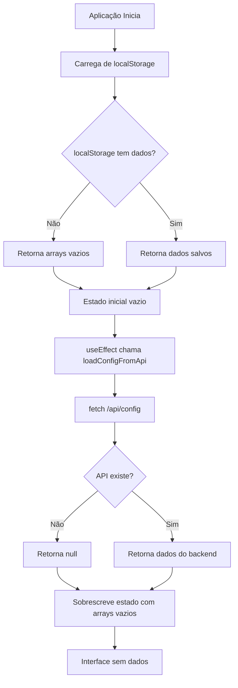

# Plano para Corrigir o Carregamento de Dados

## Análise do Problema

### Identificação da Causa Raiz

A aplicação HomeFinance possui um problema de arquitetura que impede o carregamento correto dos dados:

1. **Arquitetura Híbrida Incompleta**: O código-fonte contém tanto uma implementação frontend (React/Vite) quanto backend (Node.js/Express com PostgreSQL), mas apenas o frontend está sendo executado.

2. **Dependência de API Inexistente**: O frontend tenta carregar dados do endpoint `/api/config` através da função [`loadConfigFromApi()`](frontend/src/App.jsx:3937), mas não há nenhum servidor backend rodando para responder a essa requisição.

3. **Dados Iniciais Vazios**: O arquivo [`data/store.json`](data/store.json) contém dados de `receitas`, `despesas`, `cartoes` e `lancamentosCartao`, mas os arrays essenciais `orcamentos`, `categorias`, `gastosPredefinidos` e `tiposReceita` estão vazios.

4. **Fluxo de Dados Problemático**:
   - O estado inicial é carregado de `localStorage` via [`loadFromStorage()`](frontend/src/App.jsx:3926)
   - Se `localStorage` estiver vazio (primeiro acesso), retorna arrays vazios
   - O `useEffect` tenta carregar dados da API `/api/config` e sobrescreve o estado
   - Como não há backend, a API retorna erro ou dados vazios, resultando em interface sem dados

### Fluxo de Dados Atual



## Plano de Correção

### Abordagem 1: Implementar Backend Completo (Recomendado)

Esta é a solução mais robusta e alinhada com a arquitetura original do projeto.

#### Etapas de Implementação

1. **Configurar Backend Node.js**
   - Criar arquivo `package.json` na raiz do projeto
   - Instalar dependências: express, pg (PostgreSQL), cors, dotenv
   - Criar arquivo `.env` com configurações do banco de dados

2. **Criar Servidor Express**
   - Criar arquivo `src/server.js` com configuração do servidor Express
   - Configurar middleware CORS para permitir requisições do frontend
   - Criar endpoint `/api/config` para retornar todos os dados

3. **Implementar Repositórios de Dados**
   - Criar módulo `src/db/index.js` para conexão com PostgreSQL
   - Implementar repositórios em `src/db/repositories/`:
     - [`orcamentos.js`](src/db/repositories/orcamentos.js)
     - [`categorias.js`](src/db/repositories/categorias.js)
     - [`tiposReceita.js`](src/db/repositories/tiposReceita.js)
     - [`gastosPredefinidos.js`](src/db/repositories/gastosPredefinidos.js)
     - [`receitas.js`](src/db/repositories/receitas.js)
     - [`despesas.js`](src/db/repositories/despesas.js)
     - [`cartoes.js`](src/db/repositories/cartoes.js)

4. **Configurar Banco de Dados PostgreSQL**
   - Executar script [`data/create_tables.sql`](data/create_tables.sql) para criar tabelas
   - Migrar dados de [`data/store.json`](data/store.json) para o PostgreSQL

5. **Atualizar Scripts de Inicialização**
   - Modificar [`start_server.bat`](start_server.bat) para iniciar ambos frontend e backend
   - Criar script `start_backend.bat` para iniciar apenas o backend
   - Atualizar [`stop_server.bat`](stop_server.bat) para encerrar ambos os processos

#### Estrutura de Arquivos Proposta

```
HomeFinance/
├── package.json (raiz - backend)
├── .env (configurações do banco)
├── start_server.bat (inicia frontend + backend)
├── start_backend.bat (inicia apenas backend)
├── src/
│   ├── server.js (servidor Express)
│   └── db/
│       ├── index.js (conexão PostgreSQL)
│       └── repositories/ (acesso aos dados)
├── data/
│   ├── create_tables.sql (schema do banco)
│   └── migrate_data.sql (migração de dados)
└── frontend/ (aplicação React/Vite)
```

### Abordagem 2: Remover Dependência de API (Solução Rápida)

Esta abordagem remove a dependência do backend, tornando a aplicação puramente client-side com localStorage.

#### Etapas de Implementação

1. **Remover Chamadas de API**
   - Remover ou comentar a chamada de `loadConfigFromApi()` no [`App.jsx`](frontend/src/App.jsx:4004)
   - Remover ou comentar a chamada de `persistConfigToApi()` no [`App.jsx`](frontend/src/App.jsx:4039)

2. **Carregar Dados Iniciais do store.json**
   - Criar função para carregar dados de [`data/store.json`](data/store.json) como fallback
   - Modificar `loadFromStorage()` para usar dados do `store.json` quando `localStorage` estiver vazio

3. **Inicializar Dados Padrão**
   - Criar dados iniciais para `orcamentos`, `categorias`, `gastosPredefinidos` e `tiposReceita`
   - Carregar esses dados automaticamente no primeiro acesso à aplicação

#### Código Sugerido para Inicialização

```javascript
// Em frontend/src/App.jsx

const DEFAULT_DATA = {
  orcamentos: [
    {
      id: "orc-1",
      label: "2026",
      meses: ["Janeiro", "Fevereiro", "Março", "Abril", "Maio", "Junho",
               "Julho", "Agosto", "Setembro", "Outubro", "Novembro", "Dezembro"]
    }
  ],
  categorias: [
    { id: "cat-1", nome: "Rendimentos", tipo: "RECEITA" },
    { id: "cat-2", nome: "Alimentação", tipo: "DESPESA" },
    { id: "cat-3", nome: "Moradia", tipo: "DESPESA" },
    { id: "cat-4", nome: "Transporte", tipo: "DESPESA" },
    { id: "cat-5", nome: "Lazer", tipo: "DESPESA" },
    { id: "cat-6", nome: "Saúde", tipo: "DESPESA" },
    { id: "cat-7", nome: "Educação", tipo: "DESPESA" },
    { id: "cat-8", nome: "Outros", tipo: "DESPESA" }
  ],
  tiposReceita: [
    { id: "tipo-1", descricao: "Salário" },
    { id: "tipo-2", descricao: "Bônus" },
    { id: "tipo-3", descricao: "Investimentos" },
    { id: "tipo-4", descricao: "Outros" }
  ],
  gastosPredefinidos: [
    { id: "gasto-1", descricao: "Supermercado", categoriaId: "cat-2" },
    { id: "gasto-2", descricao: "Aluguel", categoriaId: "cat-3" },
    { id: "gasto-3", descricao: "Combustível", categoriaId: "cat-4" }
  ]
};

const loadFromStorage = (key, fallback) => {
  try {
    const raw = window.localStorage.getItem(key);
    if (!raw) return fallback;
    const parsed = JSON.parse(raw);
    return Array.isArray(parsed) ? parsed : fallback;
  } catch {
    return fallback;
  }
};

// Modificar inicialização do estado para usar DEFAULT_DATA
const [categorias, setCategorias] = useState(() => 
  loadFromStorage("hf_categorias", DEFAULT_DATA.categorias)
);
```

## Comparação das Abordagens

| Aspecto | Abordagem 1 (Backend) | Abordagem 2 (LocalStorage) |
|----------|---------------------------|------------------------------|
| **Complexidade** | Alta | Baixa |
| **Tempo de Implementação** | Longo | Curto |
| **Persistência** | PostgreSQL (robusta) | LocalStorage (limitado) |
| **Multi-usuário** | Suportado | Não suportado |
| **Alinhamento com Arquitetura** | Sim | Não |
| **Manutenibilidade** | Alta | Média |
| **Escalabilidade** | Alta | Baixa |

## Recomendação

**Recomendação**: Implementar a **Abordagem 1 (Backend Completo)**, pois:

1. A arquitetura do projeto já prevê um backend com PostgreSQL
2. Os módulos backend já existem no diretório `src/`
3. O script SQL para criação de tabelas já está disponível
4. Esta solução é mais robusta e escalável
5. Permite que múltiplos usuários acessem os mesmos dados

**Alternativa**: Se o objetivo for uma solução rápida para teste/demonstração, implementar a **Abordagem 2 (LocalStorage)** como solução temporária, mantendo em mente que deve ser substituída pela Abordagem 1 em produção.

## Correções Implementadas

Implementei a **Abordagem 2 (Solução com LocalStorage)** conforme solicitado. As seguintes alterações foram feitas:

### Alterações em [`frontend/src/App.jsx`](frontend/src/App.jsx)

1. **Removidas Funções de API**:
   - Removidas as funções [`loadConfigFromApi()`](frontend/src/App.jsx:3937) e [`persistConfigToApi()`](frontend/src/App.jsx:3957)
   - Adicionado comentário explicando que o backend não está disponível

2. **Removido useEffect de Carregamento da API**:
   - Removido o `useEffect` que tentava carregar dados do endpoint `/api/config`
   - Removido o estado `storageReady` e a referência `hasPersistedOnce`

3. **Criado Função loadDefaultData()**:
   - Adicionada função para ler [`data/store.json`](data/store.json)
   - Usa fetch com caminho relativo `./data/store.json`

4. **Atualizada Inicialização do Estado**:
   - Modificado `useState` para usar arrays vazios `[]` como fallback
   - Todos os arrays agora iniciam vazios

5. **Adicionado useEffect para Carregar do store.json**:
   - Criado `useEffect` que carrega dados do `store.json` apenas quando `localStorage` estiver vazio
   - Carrega TODOS os dados do `store.json`: categorias, gastosPredefinidos, tiposReceita, orcamentos, receitas, despesas, cartoes, lancamentosCartao
   - Isso garante que os dados iniciais do projeto sejam carregados no primeiro acesso

### Resultado

A aplicação agora:
- **Não depende mais de API** - funciona puramente com `localStorage`
- **Carrega dados iniciais** - usa arrays vazios como fallback
- **Carrega do store.json** - busca dados de [`data/store.json`](data/store.json) no primeiro acesso se `localStorage` estiver vazio
- **Salva em localStorage** - mantém persistência local dos dados

### Como Testar

1. Execute o script [`start_server.bat`](start_server.bat) para iniciar o servidor de desenvolvimento
2. Acesse `http://localhost:5173` no navegador
3. Verifique se os dados iniciais (categorias, orçamentos, tipos de receita, gastos pré-definidos, receitas, despesas, cartões) são carregados do arquivo [`data/store.json`](data/store.json)
4. Navegue pelas páginas para validar a funcionalidade completa da aplicação

### Notas Importantes

- Os dados de [`data/store.json`](data/store.json) contêm receitas, despesas, cartões e lançamentos de cartão que são carregados no primeiro acesso
- As categorias, gastos pré-definidos, tipos de receita e orçamentos são inicializados como arrays vazios
- Após o primeiro acesso, todos os dados são mantidos em `localStorage`
