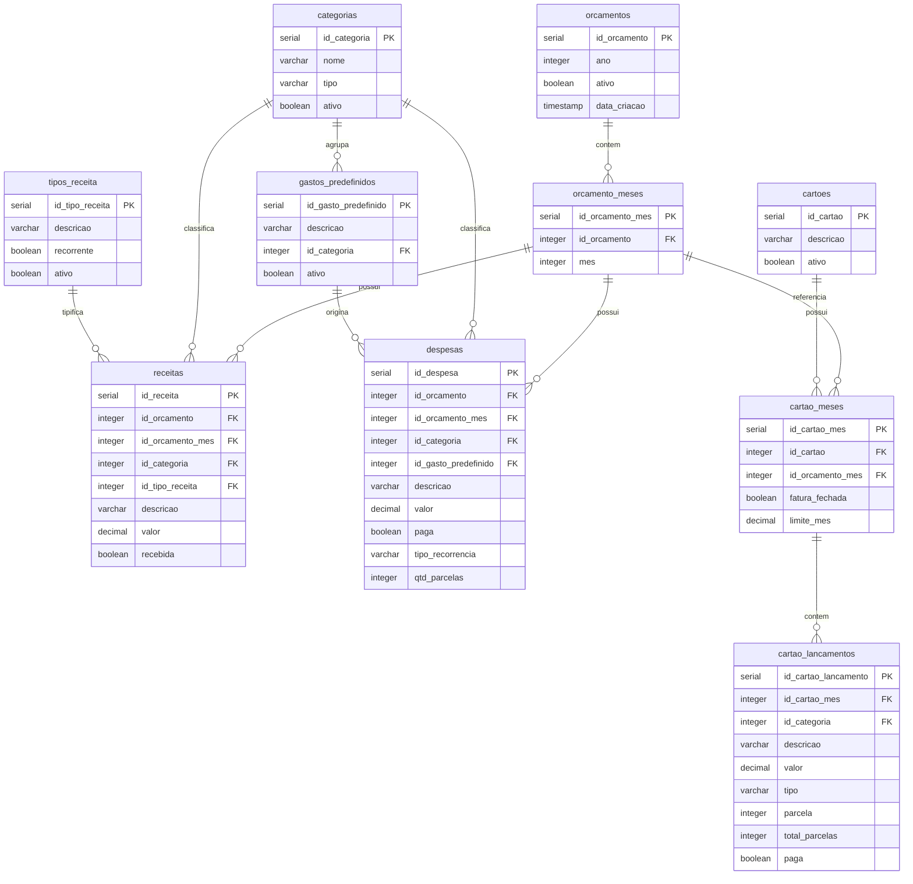
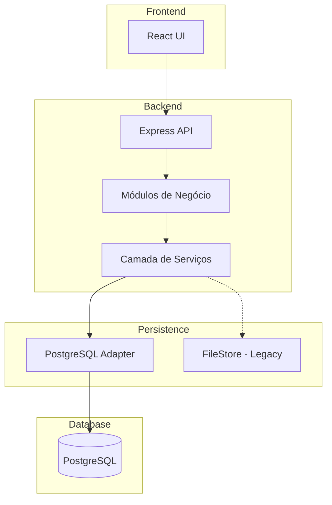

# Plano de Migração para PostgreSQL - HomeFinance

## 1. Análise da Arquitetura Atual

### 1.1 Visão Geral do Sistema

O sistema HomeFinance é uma aplicação de gestão financeira pessoal composta por:

- **Backend**: Node.js com módulos de negócio em `/src/modules/`
- **Frontend**: React/Vite em `/frontend/`
- **Persistência**: Armazenamento em arquivo JSON (`data/store.json`)

### 1.2 Estrutura de Armazenamento Atual

O arquivo [`store.json`](data/store.json) utiliza uma estrutura JSON com:

```json
{
  "meta": { "version": 1, "lastIds": {...} },
  "orcamentos": [],
  "orcamentoMeses": [],
  "categorias": [],
  "gastosPredefinidos": [],
  "tiposReceita": [],
  "receitas": [],
  "despesas": [],
  "cartoes": [],
  "cartaoMeses": [],
  "cartaoLancamentos": [],
  "frontendConfig": {...}
}
```

### 1.3 Módulos de Negócio

| Módulo | Arquivo | Responsabilidade |
|--------|---------|------------------|
| Config | [`src/modules/config.js`](src/modules/config.js) | Categorias, gastos pré-definidos, tipos de receita |
| Orçamento | [`src/modules/orcamento.js`](src/modules/orcamento.js) | Criação e consulta de orçamentos anuais |
| Receitas | [`src/modules/receitas.js`](src/modules/receitas.js) | Gestão de receitas (criação, marcação de recebido) |
| Despesas | [`src/modules/despesas.js`](src/modules/despesas.js) | Gestão de despesas (criação, marcação de pago) |
| Cartão | [`src/modules/cartao.js`](src/modules/cartao.js) | Cartões de crédito e lançamentos |
| Dashboard | [`src/modules/dashboard.js`](src/modules/dashboard.js) | Resumos e relatórios |

### 1.4 Camada de Persistência

O arquivo [`src/storage/fileStore.js`](src/storage/fileStore.js) implementa:

- `loadStore()`: Carrega o JSON do disco
- `saveStore()`: Salva o JSON no disco (com escrita atômica via arquivo temporário)
- `allocateId()`: Aloca IDs sequenciais por entidade

---

## 2. Modelo de Dados Proposto

### 2.1 Diagrama Entidade-Relacionamento



### 2.2 Alterações em Relação ao Modelo Existente

O modelo proposto em [`data/data_model.md`](data/data_model.md) e [`data/create_tables.sql`](data/create_tables.sql) está bem estruturado, mas requer alguns ajustes:

#### 2.2.1 Adições Necessárias

1. **Campo `recorrente` em `tipos_receita`**: O sistema atual utiliza este campo
2. **Campos na tabela `cartao_meses`**:
   - `fatura_fechada`: Controle de faturas fechadas
   - `limite_mes`: Limite mensal do cartão
3. **Campos na tabela `cartao_lancamentos`**:
   - `id_categoria`: Categoria do lançamento
   - `parcela`: Número da parcela atual
   - `total_parcelas`: Total de parcelas

---

## 3. Scripts DDL

### 3.1 Criação do Banco de Dados

```sql
-- Script de Criação do Banco de Dados HomeFinance
-- Dialeto: PostgreSQL
-- Versão: 2.0

-- ============================================
-- 1. ORÇAMENTOS
-- ============================================
CREATE TABLE orcamentos (
    id_orcamento SERIAL PRIMARY KEY,
    ano INTEGER NOT NULL UNIQUE,
    ativo BOOLEAN DEFAULT TRUE,
    data_criacao TIMESTAMP DEFAULT CURRENT_TIMESTAMP
);

COMMENT ON TABLE orcamentos IS 'Orçamentos anuais do sistema';
COMMENT ON COLUMN orcamentos.ano IS 'Ano fiscal do orçamento';

-- ============================================
-- 2. ORÇAMENTO MESES
-- ============================================
CREATE TABLE orcamento_meses (
    id_orcamento_mes SERIAL PRIMARY KEY,
    id_orcamento INTEGER NOT NULL,
    mes INTEGER NOT NULL CHECK (mes >= 1 AND mes <= 12),
    CONSTRAINT fk_orcamento FOREIGN KEY (id_orcamento) 
        REFERENCES orcamentos(id_orcamento) ON DELETE CASCADE,
    CONSTRAINT uk_orcamento_mes UNIQUE (id_orcamento, mes)
);

COMMENT ON TABLE orcamento_meses IS 'Subdivisão mensal dos orçamentos';

-- ============================================
-- 3. CATEGORIAS
-- ============================================
CREATE TABLE categorias (
    id_categoria SERIAL PRIMARY KEY,
    nome VARCHAR(100) NOT NULL,
    tipo VARCHAR(20) NOT NULL CHECK (tipo IN ('RECEITA', 'DESPESA')),
    ativo BOOLEAN DEFAULT TRUE,
    CONSTRAINT uk_categoria_nome_tipo UNIQUE (nome, tipo)
);

COMMENT ON TABLE categorias IS 'Categorias de classificação de receitas e despesas';

-- ============================================
-- 4. TIPOS DE RECEITA
-- ============================================
CREATE TABLE tipos_receita (
    id_tipo_receita SERIAL PRIMARY KEY,
    descricao VARCHAR(100) NOT NULL UNIQUE,
    recorrente BOOLEAN DEFAULT FALSE,
    ativo BOOLEAN DEFAULT TRUE
);

COMMENT ON TABLE tipos_receita IS 'Tipos pré-definidos de receita';

-- ============================================
-- 5. GASTOS PRÉ-DEFINIDOS
-- ============================================
CREATE TABLE gastos_predefinidos (
    id_gasto_predefinido SERIAL PRIMARY KEY,
    descricao VARCHAR(100) NOT NULL,
    id_categoria INTEGER NOT NULL,
    ativo BOOLEAN DEFAULT TRUE,
    CONSTRAINT fk_gasto_categoria FOREIGN KEY (id_categoria) 
        REFERENCES categorias(id_categoria)
);

COMMENT ON TABLE gastos_predefinidos IS 'Templates para despesas recorrentes';

-- ============================================
-- 6. RECEITAS
-- ============================================
CREATE TABLE receitas (
    id_receita SERIAL PRIMARY KEY,
    id_orcamento INTEGER NOT NULL,
    id_orcamento_mes INTEGER NOT NULL,
    id_categoria INTEGER NOT NULL,
    id_tipo_receita INTEGER,
    descricao VARCHAR(255) NOT NULL,
    valor DECIMAL(15, 2) NOT NULL CHECK (valor > 0),
    recebida BOOLEAN DEFAULT FALSE,
    CONSTRAINT fk_receita_orcamento FOREIGN KEY (id_orcamento) 
        REFERENCES orcamentos(id_orcamento) ON DELETE CASCADE,
    CONSTRAINT fk_receita_mes FOREIGN KEY (id_orcamento_mes) 
        REFERENCES orcamento_meses(id_orcamento_mes) ON DELETE CASCADE,
    CONSTRAINT fk_receita_categoria FOREIGN KEY (id_categoria) 
        REFERENCES categorias(id_categoria),
    CONSTRAINT fk_receita_tipo FOREIGN KEY (id_tipo_receita) 
        REFERENCES tipos_receita(id_tipo_receita)
);

COMMENT ON TABLE receitas IS 'Lançamentos de receitas';

-- ============================================
-- 7. DESPESAS
-- ============================================
CREATE TABLE despesas (
    id_despesa SERIAL PRIMARY KEY,
    id_orcamento INTEGER NOT NULL,
    id_orcamento_mes INTEGER NOT NULL,
    id_categoria INTEGER NOT NULL,
    id_gasto_predefinido INTEGER,
    descricao VARCHAR(255) NOT NULL,
    valor DECIMAL(15, 2) NOT NULL CHECK (valor > 0),
    paga BOOLEAN DEFAULT FALSE,
    tipo_recorrencia VARCHAR(50) CHECK (tipo_recorrencia IN ('FIXO', 'PARCELADO', 'EVENTUAL')),
    qtd_parcelas INTEGER,
    CONSTRAINT fk_despesa_orcamento FOREIGN KEY (id_orcamento) 
        REFERENCES orcamentos(id_orcamento) ON DELETE CASCADE,
    CONSTRAINT fk_despesa_mes FOREIGN KEY (id_orcamento_mes) 
        REFERENCES orcamento_meses(id_orcamento_mes) ON DELETE CASCADE,
    CONSTRAINT fk_despesa_categoria FOREIGN KEY (id_categoria) 
        REFERENCES categorias(id_categoria),
    CONSTRAINT fk_despesa_gasto FOREIGN KEY (id_gasto_predefinido) 
        REFERENCES gastos_predefinidos(id_gasto_predefinido)
);

COMMENT ON TABLE despesas IS 'Lançamentos de despesas';

-- ============================================
-- 8. CARTÕES
-- ============================================
CREATE TABLE cartoes (
    id_cartao SERIAL PRIMARY KEY,
    descricao VARCHAR(100) NOT NULL UNIQUE,
    ativo BOOLEAN DEFAULT TRUE
);

COMMENT ON TABLE cartoes IS 'Cartões de crédito cadastrados';

-- ============================================
-- 9. CARTÃO MESES (FATURAS)
-- ============================================
CREATE TABLE cartao_meses (
    id_cartao_mes SERIAL PRIMARY KEY,
    id_cartao INTEGER NOT NULL,
    id_orcamento_mes INTEGER NOT NULL,
    fatura_fechada BOOLEAN DEFAULT FALSE,
    limite_mes DECIMAL(15, 2),
    CONSTRAINT fk_cartao_mes_cartao FOREIGN KEY (id_cartao) 
        REFERENCES cartoes(id_cartao) ON DELETE CASCADE,
    CONSTRAINT fk_cartao_mes_orcamento FOREIGN KEY (id_orcamento_mes) 
        REFERENCES orcamento_meses(id_orcamento_mes) ON DELETE CASCADE,
    CONSTRAINT uk_cartao_mes UNIQUE (id_cartao, id_orcamento_mes)
);

COMMENT ON TABLE cartao_meses IS 'Faturas mensais dos cartões';

-- ============================================
-- 10. CARTÃO LANÇAMENTOS (COMPRAS)
-- ============================================
CREATE TABLE cartao_lancamentos (
    id_cartao_lancamento SERIAL PRIMARY KEY,
    id_cartao_mes INTEGER NOT NULL,
    id_categoria INTEGER,
    descricao VARCHAR(255) NOT NULL,
    valor DECIMAL(15, 2) NOT NULL CHECK (valor > 0),
    tipo VARCHAR(50) NOT NULL CHECK (tipo IN ('CORRENTE', 'PARCELADO', 'RECORRENTE')),
    parcela INTEGER,
    total_parcelas INTEGER,
    paga BOOLEAN DEFAULT FALSE,
    CONSTRAINT fk_lancamento_fatura FOREIGN KEY (id_cartao_mes) 
        REFERENCES cartao_meses(id_cartao_mes) ON DELETE CASCADE,
    CONSTRAINT fk_lancamento_categoria FOREIGN KEY (id_categoria) 
        REFERENCES categorias(id_categoria)
);

COMMENT ON TABLE cartao_lancamentos IS 'Compras/lançamentos nas faturas dos cartões';

-- ============================================
-- ÍNDICES PARA PERFORMANCE
-- ============================================
CREATE INDEX idx_receitas_mes ON receitas(id_orcamento_mes);
CREATE INDEX idx_receitas_orcamento ON receitas(id_orcamento);
CREATE INDEX idx_receitas_categoria ON receitas(id_categoria);

CREATE INDEX idx_despesas_mes ON despesas(id_orcamento_mes);
CREATE INDEX idx_despesas_orcamento ON despesas(id_orcamento);
CREATE INDEX idx_despesas_categoria ON despesas(id_categoria);

CREATE INDEX idx_cartao_lancamentos_fatura ON cartao_lancamentos(id_cartao_mes);
CREATE INDEX idx_cartao_lancamentos_categoria ON cartao_lancamentos(id_categoria);

CREATE INDEX idx_cartao_meses_cartao ON cartao_meses(id_cartao);
CREATE INDEX idx_cartao_meses_orcamento_mes ON cartao_meses(id_orcamento_mes);

CREATE INDEX idx_orcamento_meses_orcamento ON orcamento_meses(id_orcamento);
```

### 3.2 Script de Dados de Teste

```sql
-- Script de Carga de Dados de Teste
-- Baseado nos dados do store.json

-- ============================================
-- CATEGORIAS
-- ============================================
INSERT INTO categorias (nome, tipo, ativo) VALUES
('Imóvel', 'DESPESA', TRUE),
('Rendimentos', 'RECEITA', TRUE),
('Bancos/Cartões', 'DESPESA', TRUE);

-- ============================================
-- TIPOS DE RECEITA
-- ============================================
INSERT INTO tipos_receita (descricao, recorrente, ativo) VALUES
('Salário', TRUE, TRUE);

-- ============================================
-- GASTOS PRÉ-DEFINIDOS
-- ============================================
INSERT INTO gastos_predefinidos (descricao, id_categoria, ativo) VALUES
('Financiamento imobiliário BRB', 1, TRUE);

-- ============================================
-- ORÇAMENTOS
-- ============================================
INSERT INTO orcamentos (ano, ativo, data_criacao) VALUES
(2026, TRUE, NOW()),
(2027, TRUE, NOW());

-- ============================================
-- ORÇAMENTO MESES - 2026
-- ============================================
INSERT INTO orcamento_meses (id_orcamento, mes) VALUES
(1, 1),  -- Janeiro
(1, 2),  -- Fevereiro
(1, 3),  -- Março
(1, 4),  -- Abril
(1, 5),  -- Maio
(1, 6),  -- Junho
(1, 7),  -- Julho
(1, 8),  -- Agosto
(1, 9);  -- Setembro

-- ORÇAMENTO MESES - 2027
INSERT INTO orcamento_meses (id_orcamento, mes) VALUES
(2, 1), (2, 2), (2, 3), (2, 4), (2, 5), (2, 6),
(2, 7), (2, 8), (2, 9), (2, 10), (2, 11), (2, 12);

-- ============================================
-- CARTÕES
-- ============================================
INSERT INTO cartoes (descricao, ativo) VALUES
('Banco do Brasil - Visa', TRUE),
('BRB MasterCard', TRUE);

-- ============================================
-- RECEITAS DE EXEMPLO
-- ============================================
-- Salário Março (Pendente)
INSERT INTO receitas (id_orcamento, id_orcamento_mes, id_categoria, descricao, valor, recebida)
VALUES (1, 3, 2, 'Salário', 300.00, FALSE);

-- Salário Janeiro (Recebido)
INSERT INTO receitas (id_orcamento, id_orcamento_mes, id_categoria, descricao, valor, recebida)
VALUES (1, 1, 2, 'Salário', 1000.00, TRUE);

-- Extra Fevereiro (Recebido)
INSERT INTO receitas (id_orcamento, id_orcamento_mes, id_categoria, descricao, valor, recebida)
VALUES (1, 2, 2, 'Extra 2', 10000.00, TRUE);

-- ============================================
-- DESPESAS DE EXEMPLO
-- ============================================
-- Financiamento imobiliário Janeiro
INSERT INTO despesas (id_orcamento, id_orcamento_mes, id_categoria, descricao, valor, paga, tipo_recorrencia)
VALUES (1, 1, 1, 'Financiamento imobiliário', 1000.00, FALSE, 'FIXO');

-- Financiamento imobiliário Fevereiro (Pago)
INSERT INTO despesas (id_orcamento, id_orcamento_mes, id_categoria, descricao, valor, paga, tipo_recorrencia)
VALUES (1, 2, 1, 'Financiamento imobiliário', 1700.00, TRUE, 'FIXO');

-- Fatura cartão Fevereiro (Pago)
INSERT INTO despesas (id_orcamento, id_orcamento_mes, id_categoria, descricao, valor, paga, tipo_recorrencia)
VALUES (1, 2, 3, 'Fatura do cartão Banco do Brasil - Visa', 1285.00, TRUE, 'EVENTUAL');

-- ============================================
-- CARTÃO MESES
-- ============================================
INSERT INTO cartao_meses (id_cartao, id_orcamento_mes, fatura_fechada, limite_mes) VALUES
(1, 2, TRUE, 4500.00),  -- BB Visa Fevereiro
(1, 3, FALSE, 3500.00); -- BB Visa Março

-- ============================================
-- CARTÃO LANÇAMENTOS DE EXEMPLO
-- ============================================
-- Amazon - Fevereiro
INSERT INTO cartao_lancamentos (id_cartao_mes, id_categoria, descricao, valor, tipo, paga)
VALUES (1, 3, 'Amazon', 140.00, 'CORRENTE', FALSE);

-- Financiamento imobiliário - Fevereiro
INSERT INTO cartao_lancamentos (id_cartao_mes, id_categoria, descricao, valor, tipo, paga)
VALUES (1, 3, 'Financiamento imobiliário', 345.00, 'CORRENTE', FALSE);

-- Calçados parcelado (5x)
INSERT INTO cartao_lancamentos (id_cartao_mes, id_categoria, descricao, valor, tipo, parcela, total_parcelas, paga) VALUES
(1, 3, 'Calçados (1/5)', 100.00, 'PARCELADO', 1, 5, FALSE),
(2, 3, 'Calçados (2/5)', 100.00, 'PARCELADO', 2, 5, FALSE);
```

---

## 4. Estratégia de Migração

### 4.1 Visão Geral da Arquitetura Proposta



### 4.2 Fases da Migração

#### Fase 1: Infraestrutura
- [ ] Configurar conexão PostgreSQL
- [ ] Criar pool de conexões
- [ ] Implementar transações

#### Fase 2: Camada de Acesso a Dados
- [ ] Criar adaptador PostgreSQL
- [ ] Implementar padrão Repository
- [ ] Mapear entidades para tabelas

#### Fase 3: Migração dos Módulos
- [ ] Migrar módulo `config`
- [ ] Migrar módulo `orcamento`
- [ ] Migrar módulo `receitas`
- [ ] Migrar módulo `despesas`
- [ ] Migrar módulo `cartao`
- [ ] Migrar módulo `dashboard`

#### Fase 4: Testes e Validação
- [ ] Testes unitários
- [ ] Testes de integração
- [ ] Validação com dados de teste

#### Fase 5: Deploy
- [ ] Backup do sistema atual
- [ ] Deploy em ambiente de staging
- [ ] Validação final
- [ ] Deploy em produção

---

## 5. Estrutura de Arquivos Proposta

```
src/
├── config/
│   └── database.js          # Configuração do PostgreSQL
├── storage/
│   ├── fileStore.js         # Legacy - remover após migração
│   └── postgresStore.js     # Novo adaptador PostgreSQL
├── repositories/
│   ├── baseRepository.js    # Repository base com CRUD
│   ├── orcamentoRepository.js
│   ├── categoriaRepository.js
│   ├── receitaRepository.js
│   ├── despesaRepository.js
│   ├── cartaoRepository.js
│   └── index.js
├── modules/
│   ├── config.js
│   ├── orcamento.js
│   ├── receitas.js
│   ├── despesas.js
│   ├── cartao.js
│   └── dashboard.js
└── services/
    └── contracts.js
```

---

## 6. Exemplo de Implementação do Repositório

### 6.1 Configuração do Banco de Dados

```javascript
// src/config/database.js
const { Pool } = require('pg');

const pool = new Pool({
  host: process.env.DB_HOST || 'localhost',
  port: process.env.DB_PORT || 5432,
  database: process.env.DB_NAME || 'homefinance',
  user: process.env.DB_USER || 'postgres',
  password: process.env.DB_PASSWORD || 'postgres',
  max: 20,
  idleTimeoutMillis: 30000,
  connectionTimeoutMillis: 2000,
});

module.exports = {
  query: (text, params) => pool.query(text, params),
  getClient: () => pool.connect(),
  pool
};
```

### 6.2 Repository Base

```javascript
// src/repositories/baseRepository.js
const { query, getClient } = require('../config/database');

class BaseRepository {
  constructor(tableName, primaryKey) {
    this.tableName = tableName;
    this.primaryKey = primaryKey;
  }

  async findAll() {
    const result = await query(`SELECT * FROM ${this.tableName}`);
    return result.rows;
  }

  async findById(id) {
    const result = await query(
      `SELECT * FROM ${this.tableName} WHERE ${this.primaryKey} = $1`,
      [id]
    );
    return result.rows[0];
  }

  async create(data) {
    const keys = Object.keys(data);
    const values = Object.values(data);
    const placeholders = keys.map((_, i) => `$${i + 1}`).join(', ');
    const columns = keys.join(', ');
    
    const result = await query(
      `INSERT INTO ${this.tableName} (${columns}) VALUES (${placeholders}) RETURNING *`,
      values
    );
    return result.rows[0];
  }

  async update(id, data) {
    const keys = Object.keys(data);
    const values = Object.values(data);
    const setClause = keys.map((k, i) => `${k} = $${i + 2}`).join(', ');
    
    const result = await query(
      `UPDATE ${this.tableName} SET ${setClause} WHERE ${this.primaryKey} = $1 RETURNING *`,
      [id, ...values]
    );
    return result.rows[0];
  }

  async delete(id) {
    const result = await query(
      `DELETE FROM ${this.tableName} WHERE ${this.primaryKey} = $1`,
      [id]
    );
    return result.rowCount > 0;
  }

  async transaction(callback) {
    const client = await getClient();
    try {
      await client.query('BEGIN');
      const result = await callback(client);
      await client.query('COMMIT');
      return result;
    } catch (error) {
      await client.query('ROLLBACK');
      throw error;
    } finally {
      client.release();
    }
  }
}

module.exports = BaseRepository;
```

---

## 7. Dependências Necessárias

### 7.1 Pacotes npm

```json
{
  "dependencies": {
    "pg": "^8.11.0",
    "dotenv": "^16.3.1"
  }
}
```

### 7.2 Variáveis de Ambiente

```env
# .env
DB_HOST=localhost
DB_PORT=5432
DB_NAME=homefinance
DB_USER=postgres
DB_PASSWORD=postgres
NODE_ENV=development
```

---

## 8. Checklist de Implementação

### 8.1 Preparação
- [ ] Instalar PostgreSQL localmente ou configurar instância remota
- [ ] Criar banco de dados `homefinance`
- [ ] Executar script DDL de criação das tabelas
- [ ] Executar script de dados de teste

### 8.2 Backend
- [ ] Instalar dependências (`pg`, `dotenv`)
- [ ] Criar arquivo de configuração do banco
- [ ] Implementar repositórios
- [ ] Adaptar módulos de negócio
- [ ] Remover dependência do `fileStore.js`

### 8.3 Testes
- [ ] Testar cada operação CRUD
- [ ] Validar integridade referencial
- [ ] Testar transações
- [ ] Validar relatórios e dashboards

### 8.4 Documentação
- [ ] Atualizar README
- [ ] Documentar variáveis de ambiente
- [ ] Documentar estrutura do banco de dados

---

## 9. Considerações Finais

### 9.1 Vantagens da Migração

1. **Integridade de Dados**: Chaves estrangeiras e constraints garantem consistência
2. **Performance**: Índices e queries otimizadas
3. **Escalabilidade**: Suporte a múltiplos usuários simultâneos
4. **Backup**: Ferramentas nativas de backup/restore
5. **Segurança**: Controle de acesso granular

### 9.2 Riscos e Mitigações

| Risco | Mitigação |
|-------|-----------|
| Perda de dados durante migração | Manter FileStore como fallback até validação completa |
| Incompatibilidade de tipos | Mapeamento cuidadoso de tipos JSON para SQL |
| Performance inicial | Testes de carga e otimização de índices |

### 9.3 Próximos Passos

1. Aprovação deste plano
2. Configuração do ambiente PostgreSQL
3. Implementação incremental dos repositórios
4. Testes e validação
5. Deploy em produção
