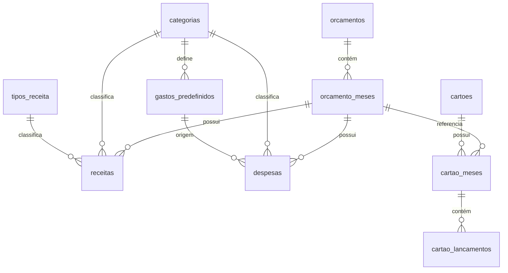
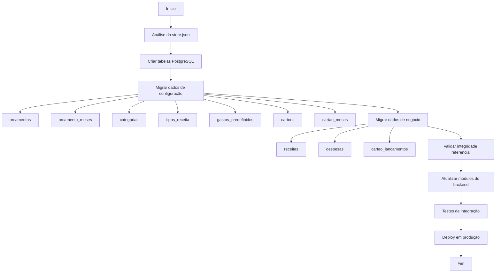

# Plano de Migração: JSON para PostgreSQL

## 1. Visão Geral

### 1.1 Sistema Atual
O sistema HomeFinance atual utiliza armazenamento em arquivo JSON (`data/store.json`) com as seguintes características:

- **Arquivo**: `data/store.json`
- **Formato de IDs**: Strings baseadas em timestamp (ex: `cat-1770170333095`, `orc-1770208001125`)
- **Estrutura**: Denormalizada com dados de configuração (`frontendConfig`) misturados aos dados de negócio
- **Persistência**: Síncrona via [`fileStore.js`](../src/storage/fileStore.js)

### 1.2 Objetivo da Migração
Migrar a persistência de dados de arquivo JSON para banco de dados PostgreSQL, proporcionando:
- Melhor performance em consultas complexas
- Integridade referencial através de chaves estrangeiras
- Escalabilidade para múltiplos usuários
- Transações ACID
- Facilidade de manutenção e evolução do schema

---

## 2. Modelo de Dados Proposto (PostgreSQL)

### 2.1 Diagrama de Entidades e Relacionamentos



### 2.2 Tabelas do Banco de Dados

#### 2.2.1 orcamentos
Armazena os orçamentos anuais.

| Campo | Tipo | Descrição | Restrições |
|---|---|---|---|
| id_orcamento | SERIAL | Identificador único | PRIMARY KEY |
| ano | INTEGER | Ano do orçamento (ex: 2026) | NOT NULL |
| ativo | BOOLEAN | Se é o orçamento atual | DEFAULT TRUE |
| data_criacao | TIMESTAMP | Data de criação | DEFAULT CURRENT_TIMESTAMP |

#### 2.2.2 orcamento_meses
Meses associados a um orçamento.

| Campo | Tipo | Descrição | Restrições |
|---|---|---|---|
| id_orcamento_mes | SERIAL | Identificador único | PRIMARY KEY |
| id_orcamento | INTEGER | Referência ao orçamento | NOT NULL, FK → orcamentos |
| mes | INTEGER | Número do mês (1-12) | NOT NULL, CHECK (1-12) |

#### 2.2.3 categorias
Categorias para classificação de receitas e despesas.

| Campo | Tipo | Descrição | Restrições |
|---|---|---|---|
| id_categoria | SERIAL | Identificador único | PRIMARY KEY |
| nome | VARCHAR(100) | Nome da categoria | NOT NULL |
| tipo | VARCHAR(20) | 'RECEITA' ou 'DESPESA' | NOT NULL, CHECK |
| ativo | BOOLEAN | Se está ativa para uso | DEFAULT TRUE |

#### 2.2.4 tipos_receita
Tipos auxiliares para receitas (ex: Salário, Extra).

| Campo | Tipo | Descrição | Restrições |
|---|---|---|---|
| id_tipo_receita | SERIAL | Identificador único | PRIMARY KEY |
| descricao | VARCHAR(100) | Descrição do tipo | NOT NULL |
| recorrente | BOOLEAN | Se é recorrente | DEFAULT TRUE |
| ativo | BOOLEAN | Se está ativo | DEFAULT TRUE |

#### 2.2.5 gastos_predefinidos
Templates para despesas recorrentes/comuns.

| Campo | Tipo | Descrição | Restrições |
|---|---|---|---|
| id_gasto_predefinido | SERIAL | Identificador único | PRIMARY KEY |
| id_categoria | INTEGER | Categoria padrão | NOT NULL, FK → categorias |
| descricao | VARCHAR(100) | Descrição do gasto | NOT NULL |
| ativo | BOOLEAN | Se está ativo | DEFAULT TRUE |

#### 2.2.6 receitas
Lançamentos de receitas.

| Campo | Tipo | Descrição | Restrições |
|---|---|---|---|
| id_receita | SERIAL | Identificador único | PRIMARY KEY |
| id_orcamento | INTEGER | Orçamento pai | NOT NULL, FK → orcamentos |
| id_orcamento_mes | INTEGER | Mês de competência | NOT NULL, FK → orcamento_meses |
| id_categoria | INTEGER | Categoria | NOT NULL, FK → categorias |
| id_tipo_receita | INTEGER | Tipo opcional | FK → tipos_receita |
| descricao | VARCHAR(255) | Descrição da receita | NOT NULL |
| complemento | VARCHAR(500) | Complemento opcional | NULL |
| valor | DECIMAL(15,2) | Valor monetário | NOT NULL |
| recebida | BOOLEAN | Status (Recebida ou não) | DEFAULT FALSE |

#### 2.2.7 despesas
Lançamentos de despesas (conta corrente/dinheiro).

| Campo | Tipo | Descrição | Restrições |
|---|---|---|---|
| id_despesa | SERIAL | Identificador único | PRIMARY KEY |
| id_orcamento | INTEGER | Orçamento pai | NOT NULL, FK → orcamentos |
| id_orcamento_mes | INTEGER | Mês de competência | NOT NULL, FK → orcamento_meses |
| id_categoria | INTEGER | Categoria | NOT NULL, FK → categorias |
| id_gasto_predefinido | INTEGER | Origem (opcional) | FK → gastos_predefinidos |
| descricao | VARCHAR(255) | Descrição da despesa | NOT NULL |
| complemento | VARCHAR(500) | Complemento opcional | NULL |
| valor | DECIMAL(15,2) | Valor monetário | NOT NULL |
| paga | BOOLEAN | Status (Paga ou não) | DEFAULT FALSE |
| tipo_recorrencia | VARCHAR(50) | 'FIXO', 'PARCELADO', 'EVENTUAL' | NOT NULL |
| qtd_parcelas | INTEGER | Quantidade total de parcelas | NULL |

#### 2.2.8 cartoes
Cadastro de cartões de crédito.

| Campo | Tipo | Descrição | Restrições |
|---|---|---|---|
| id_cartao | SERIAL | Identificador único | PRIMARY KEY |
| descricao | VARCHAR(100) | Nome do cartão (ex: Nubank) | NOT NULL |
| ativo | BOOLEAN | Se está ativo | DEFAULT TRUE |

#### 2.2.9 cartao_meses
Representa a fatura de um cartão em um mês específico.

| Campo | Tipo | Descrição | Restrições |
|---|---|---|---|
| id_cartao_mes | SERIAL | Identificador único | PRIMARY KEY |
| id_cartao | INTEGER | Cartão | NOT NULL, FK → cartoes |
| id_orcamento_mes | INTEGER | Mês de referência da fatura | NOT NULL, FK → orcamento_meses |

#### 2.2.10 cartao_lancamentos
Compras realizadas no cartão.

| Campo | Tipo | Descrição | Restrições |
|---|---|---|---|
| id_cartao_lancamento | SERIAL | Identificador único | PRIMARY KEY |
| id_cartao_mes | INTEGER | Fatura de referência | NOT NULL, FK → cartao_meses |
| descricao | VARCHAR(255) | Descrição da compra | NOT NULL |
| valor | DECIMAL(15,2) | Valor da compra | NOT NULL |
| tipo | VARCHAR(50) | 'CORRENTE', 'PARCELADO', 'RECORRENTE' | NOT NULL |
| paga | BOOLEAN | Se foi conciliado/pago | DEFAULT FALSE |

---

## 3. DDL para Criação do Banco de Dados

### 3.1 Script de Criação (DDL)

```sql
-- ============================================
-- Script de Criação do Banco de Dados HomeFinance
-- Dialeto: PostgreSQL
-- ============================================

-- Criação do banco de dados (se necessário)
-- CREATE DATABASE homefinance;

-- 1. Tabela: orcamentos
CREATE TABLE IF NOT EXISTS orcamentos (
    id_orcamento SERIAL PRIMARY KEY,
    ano INTEGER NOT NULL,
    ativo BOOLEAN DEFAULT TRUE,
    data_criacao TIMESTAMP DEFAULT CURRENT_TIMESTAMP
);

-- 2. Tabela: orcamento_meses
CREATE TABLE IF NOT EXISTS orcamento_meses (
    id_orcamento_mes SERIAL PRIMARY KEY,
    id_orcamento INTEGER NOT NULL,
    mes INTEGER NOT NULL CHECK (mes >= 1 AND mes <= 12),
    CONSTRAINT fk_orcamento FOREIGN KEY (id_orcamento)
        REFERENCES orcamentos(id_orcamento) ON DELETE CASCADE
);

-- 3. Tabela: categorias
CREATE TABLE IF NOT EXISTS categorias (
    id_categoria SERIAL PRIMARY KEY,
    nome VARCHAR(100) NOT NULL,
    tipo VARCHAR(20) NOT NULL CHECK (tipo IN ('RECEITA', 'DESPESA')),
    ativo BOOLEAN DEFAULT TRUE,
    CONSTRAINT uq_categoria_nome_tipo UNIQUE (nome, tipo)
);

-- 4. Tabela: tipos_receita
CREATE TABLE IF NOT EXISTS tipos_receita (
    id_tipo_receita SERIAL PRIMARY KEY,
    descricao VARCHAR(100) NOT NULL,
    recorrente BOOLEAN DEFAULT TRUE,
    ativo BOOLEAN DEFAULT TRUE,
    CONSTRAINT uq_tipo_receita_descricao UNIQUE (descricao)
);

-- 5. Tabela: gastos_predefinidos
CREATE TABLE IF NOT EXISTS gastos_predefinidos (
    id_gasto_predefinido SERIAL PRIMARY KEY,
    id_categoria INTEGER NOT NULL,
    descricao VARCHAR(100) NOT NULL,
    ativo BOOLEAN DEFAULT TRUE,
    CONSTRAINT fk_gasto_categoria FOREIGN KEY (id_categoria)
        REFERENCES categorias(id_categoria)
);

-- 6. Tabela: receitas
CREATE TABLE IF NOT EXISTS receitas (
    id_receita SERIAL PRIMARY KEY,
    id_orcamento INTEGER NOT NULL,
    id_orcamento_mes INTEGER NOT NULL,
    id_categoria INTEGER NOT NULL,
    id_tipo_receita INTEGER,
    descricao VARCHAR(255) NOT NULL,
    complemento VARCHAR(500),
    valor DECIMAL(15, 2) NOT NULL,
    recebida BOOLEAN DEFAULT FALSE,
    CONSTRAINT fk_receita_orcamento FOREIGN KEY (id_orcamento)
        REFERENCES orcamentos(id_orcamento) ON DELETE CASCADE,
    CONSTRAINT fk_receita_mes FOREIGN KEY (id_orcamento_mes)
        REFERENCES orcamento_meses(id_orcamento_mes) ON DELETE CASCADE,
    CONSTRAINT fk_receita_categoria FOREIGN KEY (id_categoria)
        REFERENCES categorias(id_categoria),
    CONSTRAINT fk_receita_tipo FOREIGN KEY (id_tipo_receita)
        REFERENCES tipos_receita(id_tipo_receita)
);

-- 7. Tabela: despesas
CREATE TABLE IF NOT EXISTS despesas (
    id_despesa SERIAL PRIMARY KEY,
    id_orcamento INTEGER NOT NULL,
    id_orcamento_mes INTEGER NOT NULL,
    id_categoria INTEGER NOT NULL,
    id_gasto_predefinido INTEGER,
    descricao VARCHAR(255) NOT NULL,
    complemento VARCHAR(500),
    valor DECIMAL(15, 2) NOT NULL,
    paga BOOLEAN DEFAULT FALSE,
    tipo_recorrencia VARCHAR(50) NOT NULL CHECK (tipo_recorrencia IN ('FIXO', 'PARCELADO', 'EVENTUAL')),
    qtd_parcelas INTEGER,
    CONSTRAINT fk_despesa_orcamento FOREIGN KEY (id_orcamento)
        REFERENCES orcamentos(id_orcamento) ON DELETE CASCADE,
    CONSTRAINT fk_despesa_mes FOREIGN KEY (id_orcamento_mes)
        REFERENCES orcamento_meses(id_orcamento_mes) ON DELETE CASCADE,
    CONSTRAINT fk_despesa_categoria FOREIGN KEY (id_categoria)
        REFERENCES categorias(id_categoria),
    CONSTRAINT fk_despesa_gasto FOREIGN KEY (id_gasto_predefinido)
        REFERENCES gastos_predefinidos(id_gasto_predefinido)
);

-- 8. Tabela: cartoes
CREATE TABLE IF NOT EXISTS cartoes (
    id_cartao SERIAL PRIMARY KEY,
    descricao VARCHAR(100) NOT NULL,
    ativo BOOLEAN DEFAULT TRUE
);

-- 9. Tabela: cartao_meses
CREATE TABLE IF NOT EXISTS cartao_meses (
    id_cartao_mes SERIAL PRIMARY KEY,
    id_cartao INTEGER NOT NULL,
    id_orcamento_mes INTEGER NOT NULL,
    CONSTRAINT fk_cartao_mes_cartao FOREIGN KEY (id_cartao)
        REFERENCES cartoes(id_cartao) ON DELETE CASCADE,
    CONSTRAINT fk_cartao_mes_orcamento FOREIGN KEY (id_orcamento_mes)
        REFERENCES orcamento_meses(id_orcamento_mes) ON DELETE CASCADE,
    CONSTRAINT uq_cartao_mes UNIQUE (id_cartao, id_orcamento_mes)
);

-- 10. Tabela: cartao_lancamentos
CREATE TABLE IF NOT EXISTS cartao_lancamentos (
    id_cartao_lancamento SERIAL PRIMARY KEY,
    id_cartao_mes INTEGER NOT NULL,
    descricao VARCHAR(255) NOT NULL,
    valor DECIMAL(15, 2) NOT NULL,
    tipo VARCHAR(50) NOT NULL CHECK (tipo IN ('CORRENTE', 'PARCELADO', 'RECORRENTE')),
    paga BOOLEAN DEFAULT FALSE,
    CONSTRAINT fk_lancamento_fatura FOREIGN KEY (id_cartao_mes)
        REFERENCES cartao_meses(id_cartao_mes) ON DELETE CASCADE
);

-- Índices para performance
CREATE INDEX IF NOT EXISTS idx_receitas_mes ON receitas(id_orcamento_mes);
CREATE INDEX IF NOT EXISTS idx_despesas_mes ON despesas(id_orcamento_mes);
CREATE INDEX IF NOT EXISTS idx_cartao_lancamentos_fatura ON cartao_lancamentos(id_cartao_mes);
CREATE INDEX IF NOT EXISTS idx_orcamentos_ano ON orcamentos(ano);
CREATE INDEX IF NOT EXISTS idx_categorias_tipo ON categorias(tipo);
```

---

## 4. Script de Inserção de Dados de Teste

Baseado nos dados do [`store.json`](../data/store.json), segue script para popular o banco de dados com dados de teste:

```sql
-- ============================================
-- Script de Inserção de Dados de Teste
-- Baseado em data/store.json
-- ============================================

-- Limpar dados existentes (para testes)
-- TRUNCATE TABLE cartao_lancamentos, cartao_meses, cartoes CASCADE;
-- TRUNCATE TABLE despesas, receitas CASCADE;
-- TRUNCATE TABLE gastos_predefinidos, tipos_receita, categorias CASCADE;
-- TRUNCATE TABLE orcamento_meses, orcamentos CASCADE;

-- 1. Inserir Orçamentos
INSERT INTO orcamentos (id_orcamento, ano, ativo) VALUES
    (1, 2026, TRUE),
    (2, 2027, FALSE);

-- 2. Inserir Meses dos Orçamentos
-- Orçamento 2026 (Janeiro a Setembro)
INSERT INTO orcamento_meses (id_orcamento_mes, id_orcamento, mes) VALUES
    (1, 1, 1),   -- Janeiro
    (2, 1, 2),   -- Fevereiro
    (3, 1, 3),   -- Março
    (4, 1, 4),   -- Abril
    (5, 1, 5),   -- Maio
    (6, 1, 6),   -- Junho
    (7, 1, 7),   -- Julho
    (8, 1, 8),   -- Agosto
    (9, 1, 9);   -- Setembro

-- Orçamento 2027 (Outubro a Dezembro)
INSERT INTO orcamento_meses (id_orcamento_mes, id_orcamento, mes) VALUES
    (10, 2, 10), -- Outubro
    (11, 2, 11), -- Novembro
    (12, 2, 12); -- Dezembro

-- 3. Inserir Categorias
INSERT INTO categorias (id_categoria, nome, tipo) VALUES
    (1, 'Imóvel', 'DESPESA'),
    (2, 'Rendimentos', 'RECEITA'),
    (3, 'Bancos/Cartões', 'DESPESA');

-- 4. Inserir Tipos de Receita
INSERT INTO tipos_receita (id_tipo_receita, descricao, recorrente) VALUES
    (1, 'Salário', TRUE),
    (2, 'Extra', FALSE);

-- 5. Inserir Gastos Pré-definidos
INSERT INTO gastos_predefinidos (id_gasto_predefinido, id_categoria, descricao) VALUES
    (1, 1, 'Financiamento imobiliário BRB');

-- 6. Inserir Cartões
INSERT INTO cartoes (id_cartao, descricao) VALUES
    (1, 'Banco do Brasil - Visa'),
    (2, 'BRB MasterCard');

-- 7. Inserir Cartão Meses (Faturas)
-- Cartão 1 - Banco do Brasil
INSERT INTO cartao_meses (id_cartao_mes, id_cartao, id_orcamento_mes) VALUES
    (1, 1, 2),  -- Fevereiro 2026
    (2, 1, 3),  -- Março 2026
    (3, 1, 4),  -- Abril 2026
    (4, 1, 5),  -- Maio 2026
    (5, 1, 6),  -- Junho 2026
    (6, 1, 7),  -- Julho 2026
    (7, 1, 8),  -- Agosto 2026
    (8, 1, 9);  -- Setembro 2026

-- 8. Inserir Receitas
INSERT INTO receitas (id_receita, id_orcamento, id_orcamento_mes, id_categoria, id_tipo_receita, descricao, valor, recebida) VALUES
    -- Salários
    (1, 1, 3, 2, 1, 'Salário', 300.00, FALSE),
    (2, 1, 1, 2, 1, 'Salário', 1000.00, TRUE),
    (3, 1, 2, 2, 2, 'Extra 2', 10000.00, TRUE),
    (4, 1, 2, 2, 1, 'Salário', 6700.00, FALSE),
    (5, 1, 2, 2, 1, 'Serviço extra', 1000.00, FALSE),
    (6, 1, 8, 2, 1, 'Salário', 100.00, FALSE);

-- 9. Inserir Despesas
INSERT INTO despesas (id_despesa, id_orcamento, id_orcamento_mes, id_categoria, id_gasto_predefinido, descricao, complemento, valor, paga, tipo_recorrencia, qtd_parcelas) VALUES
    -- Financiamento imobiliário (FIXO - todos os meses)
    (1, 1, 5, 1, 1, 'Financiamento imobiliário', NULL, 1500.00, FALSE, 'FIXO', NULL),
    (2, 1, 4, 1, 1, 'Financiamento imobiliário', NULL, 1200.00, FALSE, 'FIXO', NULL),
    (3, 1, 1, 1, 1, 'Financiamento imobiliário', NULL, 1000.00, FALSE, 'FIXO', NULL),
    (4, 1, 2, 1, 1, 'Financiamento imobiliário', 'Casa', 1700.00, TRUE, 'EVENTUAL', NULL),
    (5, 1, 3, 3, NULL, 'Fatura do cartão Visa Banco do Brasil', NULL, 500.00, FALSE, 'EVENTUAL', NULL),
    (6, 1, 4, 3, NULL, 'Fatura do cartão Visa Banco do Brasil', NULL, 500.00, FALSE, 'EVENTUAL', NULL),
    (7, 1, 5, 3, NULL, 'Fatura do cartão Visa Banco do Brasil', NULL, 500.00, FALSE, 'EVENTUAL', NULL),
    (8, 1, 6, 3, NULL, 'Fatura do cartão Visa Banco do Brasil', NULL, 500.00, FALSE, 'EVENTUAL', NULL),
    (9, 1, 7, 3, NULL, 'Fatura do cartão Visa Banco do Brasil', NULL, 500.00, FALSE, 'EVENTUAL', NULL),
    (10, 1, 8, 3, NULL, 'Fatura do cartão Visa Banco do Brasil', NULL, 500.00, FALSE, 'EVENTUAL', NULL),
    (11, 1, 9, 3, NULL, 'Fatura do cartão Visa Banco do Brasil', NULL, 500.00, FALSE, 'EVENTUAL', NULL),
    (12, 1, 2, 3, NULL, 'Fatura do cartão Banco do Brasil - Visa', NULL, 1285.00, TRUE, 'EVENTUAL', NULL),
    (13, 1, 3, 3, NULL, 'Fatura do cartão Banco do Brasil - Visa', NULL, 3500.00, FALSE, 'EVENTUAL', NULL),
    (14, 1, 1, 3, NULL, 'Fatura do cartão Banco do Brasil - Visa', NULL, 200.00, FALSE, 'EVENTUAL', NULL),
    (15, 1, 4, 3, NULL, 'Fatura do cartão Banco do Brasil - Visa', NULL, 4300.00, FALSE, 'EVENTUAL', NULL),
    (16, 1, 5, 3, NULL, 'Fatura do cartão Banco do Brasil - Visa', NULL, 300.00, FALSE, 'EVENTUAL', NULL),
    (17, 1, 6, 3, NULL, 'Fatura do cartão Banco do Brasil - Visa', NULL, 300.00, FALSE, 'EVENTUAL', NULL),
    (18, 1, 7, 3, NULL, 'Fatura do cartão Banco do Brasil - Visa', NULL, 200.00, FALSE, 'EVENTUAL', NULL),
    (19, 1, 8, 3, NULL, 'Fatura do cartão Banco do Brasil - Visa', NULL, 200.00, FALSE, 'EVENTUAL', NULL),
    (20, 1, 9, 3, NULL, 'Fatura do cartão Banco do Brasil - Visa', NULL, 200.00, FALSE, 'EVENTUAL', NULL),
    (21, 2, 10, 3, NULL, 'Fatura do cartão Banco do Brasil - Visa', NULL, 200.00, FALSE, 'EVENTUAL', NULL),
    (22, 2, 11, 3, NULL, 'Fatura do cartão Banco do Brasil - Visa', NULL, 200.00, FALSE, 'EVENTUAL', NULL),
    (23, 2, 12, 3, NULL, 'Fatura do cartão Banco do Brasil - Visa', NULL, 200.00, FALSE, 'EVENTUAL', NULL),
    (24, 1, 2, 1, 1, 'Financiamento imobiliário BRB', 'Casa', 2520.00, FALSE, 'FIXO', NULL);

-- 10. Inserir Lançamentos de Cartão
INSERT INTO cartao_lancamentos (id_cartao_lancamento, id_cartao_mes, descricao, valor, tipo, paga) VALUES
    -- Amazon
    (1, 1, 'Amazon', 140.00, 'CORRENTE', FALSE),
    -- Financiamento imobiliário
    (2, 1, 'Financiamento imobiliário', 345.00, 'CORRENTE', FALSE),
    (3, 2, 'Financiamento imobiliário', 4000.00, 'RECORRENTE', FALSE),
    -- Calçados (parcelado 5x)
    (4, 1, 'Calçados (1/5)', 100.00, 'PARCELADO', FALSE),
    (5, 2, 'Calçados (2/5)', 100.00, 'PARCELADO', FALSE),
    (6, 3, 'Calçados (3/5)', 100.00, 'PARCELADO', FALSE),
    (7, 4, 'Calçados (4/5)', 100.00, 'PARCELADO', FALSE),
    (8, 5, 'Calçados (5/5)', 100.00, 'PARCELADO', FALSE),
    -- Compra parcelada (2x)
    (9, 1, 'Compra parcelada (1/2)', 500.00, 'PARCELADO', FALSE),
    (10, 2, 'Compra parcelada (2/2)', 500.00, 'PARCELADO', FALSE),
    -- Água (FIXO - todos os meses)
    (11, 1, 'Água', 200.00, 'RECORRENTE', FALSE),
    (12, 2, 'Água', 200.00, 'RECORRENTE', FALSE),
    (13, 3, 'Água', 200.00, 'RECORRENTE', FALSE),
    (14, 4, 'Água', 200.00, 'RECORRENTE', FALSE),
    (15, 5, 'Água', 200.00, 'RECORRENTE', FALSE),
    (16, 6, 'Água', 200.00, 'RECORRENTE', FALSE),
    (17, 7, 'Água', 200.00, 'RECORRENTE', FALSE),
    (18, 8, 'Água', 200.00, 'RECORRENTE', FALSE),
    (19, 9, 'Água', 200.00, 'RECORRENTE', FALSE);
```

---

## 5. Estratégia de Migração

### 5.1 Fluxo de Migração



### 5.2 Mapeamento de IDs

O sistema atual utiliza IDs baseados em strings (ex: `cat-1770170333095`, `orc-1770208001125`). A migração deve:

1. **Criar mapa de conversão**: `Map<string, number>` onde `key` = ID antigo (string) e `value` = novo ID numérico
2. **Migrar na ordem correta** (dependências primeiro):
   - 1º: orcamentos
   - 2º: orcamento_meses
   - 3º: categorias
   - 4º: tipos_receita
   - 5º: gastos_predefinidos
   - 6º: cartoes
   - 7º: cartao_meses
   - 8º: receitas
   - 9º: despesas
   - 10º: cartao_lancamentos

### 5.3 Tratamento de Campos Especiais

| Campo | Tratamento |
|---|---|
| `mes` (string) | Converter de nome ("Janeiro") para número (1) |
| `status` | Mapear "Pendente" → FALSE, "Recebido"/"Pago" → TRUE |
| `tipoRecorrencia` | Mapear "FIXO", "PARCELADO", "EVENTUAL" → tipo_recorrencia |
| `parcela`, `totalParcelas` | Armazenar na descrição ou criar campo adicional |

---

## 6. Implementação da Camada de Persistência

### 6.1 Estrutura de Diretórios Proposta

```
src/
├── storage/
│   ├── fileStore.js          # (manter para compatibilidade)
│   └── db/
│       ├── connection.js     # Conexão PostgreSQL
│       ├── repositories/     # Repositórios por entidade
│       │   ├── orcamentoRepository.js
│       │   ├── receitaRepository.js
│       │   ├── despesaRepository.js
│       │   ├── cartaoRepository.js
│       │   ├── categoriaRepository.js
│       │   ├── tipoReceitaRepository.js
│       │   └── gastoPredefinidoRepository.js
│       └── migrations/       # Scripts de migração
│           └── migrate.js
```

### 6.2 Módulo de Conexão (connection.js)

```javascript
const { Pool } = require('pg');

const pool = new Pool({
    user: process.env.DB_USER || 'postgres',
    host: process.env.DB_HOST || 'localhost',
    database: process.env.DB_NAME || 'homefinance',
    password: process.env.DB_PASSWORD || 'postgres',
    port: process.env.DB_PORT || 5432,
});

module.exports = {
    query: (text, params) => pool.query(text, params),
    pool
};
```

### 6.3 Exemplo de Repositório (orcamentoRepository.js)

```javascript
const { query } = require('../connection');

const OrcamentoRepository = {
    create: async ({ ano, meses }) => {
        const client = await query.pool.connect();
        try {
            await client.query('BEGIN');
            
            const result = await client.query(
                'INSERT INTO orcamentos (ano) VALUES ($1) RETURNING id_orcamento',
                [ano]
            );
            const id_orcamento = result.rows[0].id_orcamento;
            
            for (const mes of meses) {
                await client.query(
                    'INSERT INTO orcamento_meses (id_orcamento, mes) VALUES ($1, $2)',
                    [id_orcamento, mes]
                );
            }
            
            await client.query('COMMIT');
            return { id_orcamento };
        } catch (error) {
            await client.query('ROLLBACK');
            throw error;
        } finally {
            client.release();
        }
    },
    
    getById: async (id_orcamento) => {
        const result = await query(
            'SELECT * FROM orcamentos WHERE id_orcamento = $1',
            [id_orcamento]
        );
        return result.rows[0];
    },
    
    getMeses: async (id_orcamento) => {
        const result = await query(
            'SELECT mes FROM orcamento_meses WHERE id_orcamento = $1 ORDER BY mes',
            [id_orcamento]
        );
        return result.rows.map(r => r.mes);
    }
};

module.exports = OrcamentoRepository;
```

---

## 7. Atualização dos Módulos Existentes

### 7.1 Estratégia de Transição

1. **Fase 1**: Criar novos repositórios PostgreSQL
2. **Fase 2**: Atualizar módulos para usar repositórios
3. **Fase 3**: Manter [`fileStore.js`](../src/storage/fileStore.js) para rollback se necessário
4. **Fase 4**: Remover [`fileStore.js`](../src/storage/fileStore.js) após validação

### 7.2 Exemplo de Atualização (orcamento.js)

```javascript
// Antes (usando fileStore)
const { loadStore, saveStore, allocateId } = require("../storage/fileStore");

// Depois (usando repositório PostgreSQL)
const OrcamentoRepository = require("../storage/db/repositories/orcamentoRepository");

const criarOrcamento = async ({ ano, meses }) => {
    // Validações mantidas
    assert(Number.isInteger(ano), "Ano inválido");
    validateMonths(meses);
    
    // Chamada ao repositório
    const { id_orcamento } = await OrcamentoRepository.create({ ano, meses });
    return { id_orcamento };
};
```

---

## 8. Variáveis de Ambiente

Adicionar ao `.env` ou configurar no ambiente:

```env
# Configurações do PostgreSQL
DB_HOST=localhost
DB_PORT=5432
DB_NAME=homefinance
DB_USER=postgres
DB_PASSWORD=postgres
```

---

## 9. Testes de Validação

### 9.1 Checklist de Validação

- [ ] Todas as tabelas foram criadas corretamente
- [ ] Dados de teste foram inseridos com sucesso
- [ ] Integridade referencial está funcionando
- [ ] Operações CRUD funcionam para todas as entidades
- [ ] Transações são tratadas corretamente
- [ ] Performance das consultas está adequada
- [ ] Frontend continua funcionando com o backend atualizado

### 9.2 Consultas de Validação

```sql
-- Verificar contagem de registros
SELECT 'orcamentos' as tabela, COUNT(*) as total FROM orcamentos
UNION ALL
SELECT 'orcamento_meses', COUNT(*) FROM orcamento_meses
UNION ALL
SELECT 'categorias', COUNT(*) FROM categorias
UNION ALL
SELECT 'receitas', COUNT(*) FROM receitas
UNION ALL
SELECT 'despesas', COUNT(*) FROM despesas
UNION ALL
SELECT 'cartoes', COUNT(*) FROM cartoes
UNION ALL
SELECT 'cartao_meses', COUNT(*) FROM cartao_meses
UNION ALL
SELECT 'cartao_lancamentos', COUNT(*) FROM cartao_lancamentos;

-- Verificar integridade referencial
SELECT COUNT(*) as receitas_sem_categoria
FROM receitas r
LEFT JOIN categorias c ON r.id_categoria = c.id_categoria
WHERE c.id_categoria IS NULL;

SELECT COUNT(*) as despesas_sem_categoria
FROM despesas d
LEFT JOIN categorias c ON d.id_categoria = c.id_categoria
WHERE c.id_categoria IS NULL;
```

---

## 10. Passos de Implementação

### Etapa 1: Preparação do Ambiente
1. Instalar PostgreSQL
2. Criar banco de dados `homefinance`
3. Instalar dependência `pg` no Node.js
4. Configurar variáveis de ambiente

### Etapa 2: Criação do Banco de Dados
1. Executar script DDL para criar tabelas
2. Executar script de inserção de dados de teste
3. Validar estrutura do banco

### Etapa 3: Implementação da Camada de Persistência
1. Criar módulo de conexão ([`connection.js`](../src/storage/db/connection.js))
2. Criar repositórios para cada entidade
3. Implementar script de migração ([`migrate.js`](../src/storage/db/migrations/migrate.js))

### Etapa 4: Atualização dos Módulos
1. Atualizar [`orcamento.js`](../src/modules/orcamento.js)
2. Atualizar [`receitas.js`](../src/modules/receitas.js)
3. Atualizar [`despesas.js`](../src/modules/despesas.js)
4. Atualizar [`cartao.js`](../src/modules/cartao.js)
5. Atualizar [`config.js`](../src/modules/config.js)
6. Atualizar [`dashboard.js`](../src/modules/dashboard.js)

### Etapa 5: Testes
1. Testar operações CRUD
2. Testar integridade referencial
3. Testar transações
4. Testar integração com frontend

### Etapa 6: Deploy
1. Backup do banco de dados
2. Executar migração em ambiente de produção
3. Monitorar logs e erros
4. Validar funcionamento do sistema

---

## 11. Considerações Importantes

1. **Não reaproveitar dados do `store.json`**: Conforme solicitado, os dados existentes não serão migrados. O sistema começará com dados limpos.

2. **Compatibilidade com Frontend**: O frontend deve continuar funcionando sem alterações, pois a API permanecerá a mesma.

3. **Rollback**: Manter o [`fileStore.js`](../src/storage/fileStore.js) por um período para facilitar rollback se necessário.

4. **Performance**: Os índices criados garantirão performance adequada para as consultas mais comuns.

5. **Transações**: Operações que envolvem múltiplas tabelas devem usar transações para garantir consistência.

---

## 12. Arquivos a Serem Criados/Modificados

### Novos Arquivos
- [`src/storage/db/connection.js`](../src/storage/db/connection.js) - Conexão PostgreSQL
- [`src/storage/db/repositories/orcamentoRepository.js`](../src/storage/db/repositories/orcamentoRepository.js)
- [`src/storage/db/repositories/receitaRepository.js`](../src/storage/db/repositories/receitaRepository.js)
- [`src/storage/db/repositories/despesaRepository.js`](../src/storage/db/repositories/despesaRepository.js)
- [`src/storage/db/repositories/cartaoRepository.js`](../src/storage/db/repositories/cartaoRepository.js)
- [`src/storage/db/repositories/categoriaRepository.js`](../src/storage/db/repositories/categoriaRepository.js)
- [`src/storage/db/repositories/tipoReceitaRepository.js`](../src/storage/db/repositories/tipoReceitaRepository.js)
- [`src/storage/db/repositories/gastoPredefinidoRepository.js`](../src/storage/db/repositories/gastoPredefinidoRepository.js)
- [`src/storage/db/migrations/migrate.js`](../src/storage/db/migrations/migrate.js) - Script de migração
- [`data/insert_test_data.sql`](../data/insert_test_data.sql) - Script de inserção de dados de teste

### Arquivos a Modificar
- [`data/create_tables.sql`](../data/create_tables.sql) - Atualizar DDL com campos adicionais
- [`src/modules/orcamento.js`](../src/modules/orcamento.js) - Usar repositórios PostgreSQL
- [`src/modules/receitas.js`](../src/modules/receitas.js) - Usar repositórios PostgreSQL
- [`src/modules/despesas.js`](../src/modules/despesas.js) - Usar repositórios PostgreSQL
- [`src/modules/cartao.js`](../src/modules/cartao.js) - Usar repositórios PostgreSQL
- [`src/modules/config.js`](../src/modules/config.js) - Usar repositórios PostgreSQL
- [`src/modules/dashboard.js`](../src/modules/dashboard.js) - Usar repositórios PostgreSQL
- [`package.json`](../package.json) - Adicionar dependência `pg`

---

## 13. Conclusão

Este plano detalha a migração completa do sistema HomeFinance de armazenamento em arquivo JSON para banco de dados PostgreSQL. A migração proporcionará melhor performance, integridade referencial e escalabilidade, mantendo a compatibilidade com o frontend existente.

Os scripts DDL e de inserção de dados de teste fornecidos permitem a implementação imediata do novo modelo de dados, enquanto a estratégia de migração detalhada garante uma transição segura e controlada.
